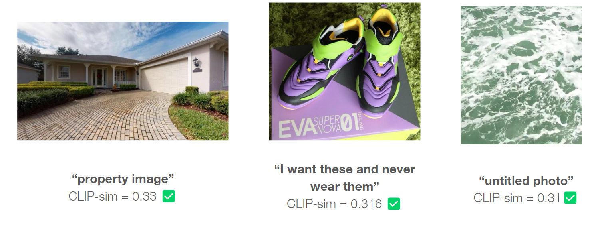

# Hyperbolic Data Filtering

<p align="center"></p>

## Installation

Please follow the installation guides provided by the official repository of MERU:

This code requires `python>=3.9`, as well as `pytorch>=1.7` and `torchvision>=0.8`.
We recommend using [Conda](https://conda.io/docs/user-guide/install/download.html)
to set up the codebase.

```
git clone git@github.com:facebookresearch/meru.git
cd meru
conda create -n meru python=3.9 --yes
conda activate meru
```

Install torch and torchvision following the instructions on [pytorch.org](https://pytorch.org).
Then install the remaining dependencies, and this codebase as a dev package:

```
python -m pip install --pre timm
python -m pip install -r requirements.txt
python setup.py develop
```

For the DataComp installation and dataset download, please refer to the README.md in the datacomp subfolder.

## Trained model checkpoints

We use the following MERU model to calculate the MERU x_time for image-text pairs.
Click the links below to download model checkpoints.
Their training configs are available in [`./configs`](./configs) directory.

- Model: [MERU ViT-large](https://dl.fbaipublicfiles.com/meru/meru_vit_l.pth) and config: [train_meru_vit_l.py](./configs/train_meru_vit_l.py)

The majority of the MERU project is licensed under CC-BY-NC, however portions of the project are available under separate license terms:
https://github.com/openai/clip, https://github.com/facebookresearch/slip, and https://github.com/kdexd/virtex are licensed under the MIT license.

## Pipeline

We first use the datacomp/full_compare.py to calculate and save the MERU x_time for all image-text pairs in DataComp-small, and then merge it to the metadata of DataComp-small using datacomp/convert.py. For data filtering, training, and evaluation, we run the following commands inside datacomp:

```
python baselines.py --metadata_dir your_metadata_path --save_path your_save_path/some_name.npy --name x_time_intersect_clip_score --arch l14 --xtime_arch l  --fraction value_between_0_and_1 --xtime_fraction value_between_0_and_1
python resharder.py -i your_dataset_path -o your_subdataset_path -s your_save_path/some_name.npy
torchrun --nproc_per_node your_ngpus train.py --scale small --data_dir your_subdataset_path --output_dir your_output_path --exp_name some_name
python evaluate.py  --train_output_dir your_output_path --data_dir your_eval_set_path
```

